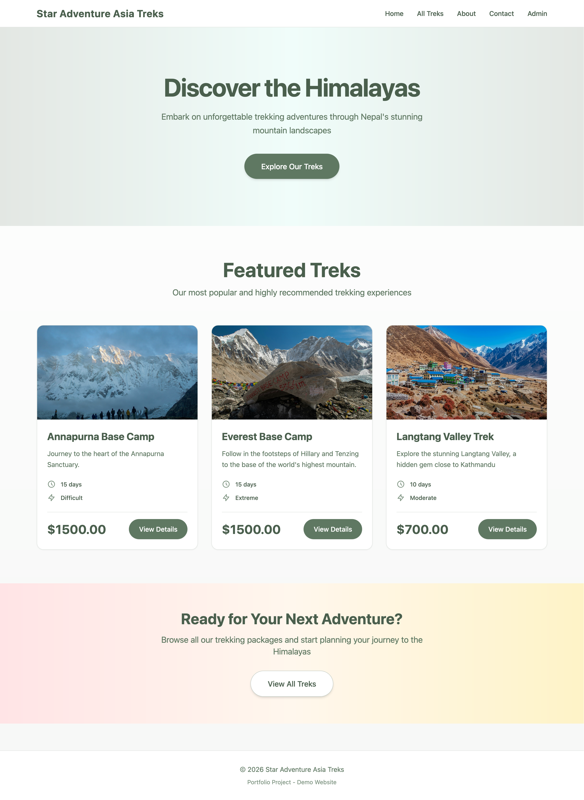
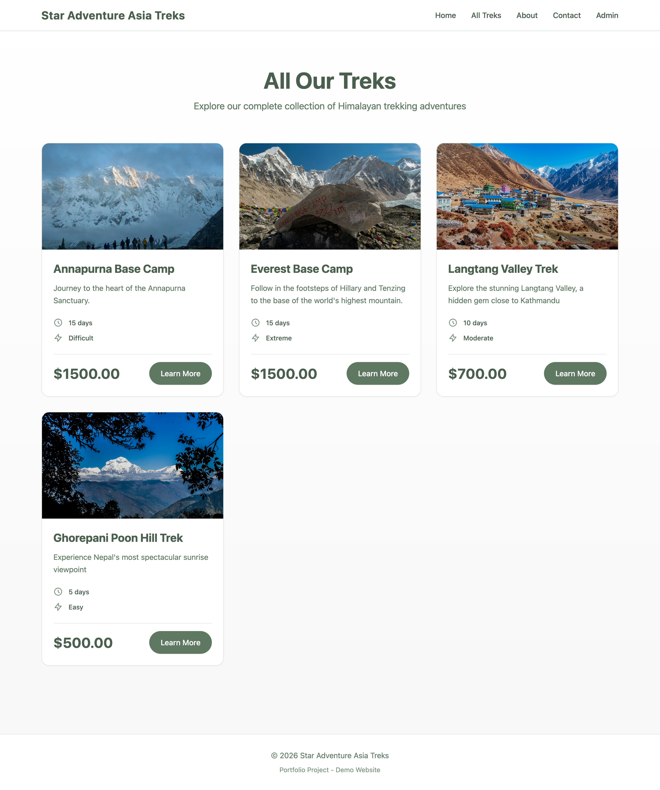
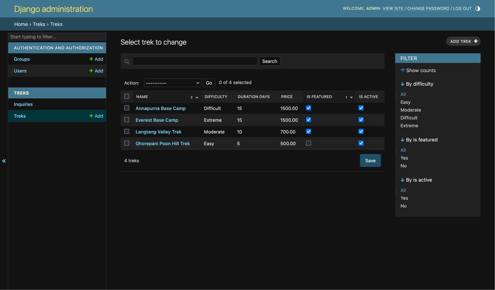

# Star Adventure Asia Treks

A full-stack web application for showcasing Himalayan trekking packages, built with Django and PostgreSQL.

## 🎯 About This Project

This platform was created as a portfolio project inspired by my father's former trekking agency in Nepal. While the business is not currently operational, I built this to demonstrate full-stack web development skills with real-world business requirements.

**Live Demo:** https://web-production-c4d89.up.railway.app

---

## ✨ Features

- Trek catalog with images, difficulty ratings, duration, and pricing
- Customer inquiry system with admin dashboard
- Responsive mobile-first design with custom color scheme
- Full CRUD operations for trek management
- PostgreSQL database with Django ORM

---

## 🛠️ Tech Stack

- **Backend:** Python, Django, PostgreSQL
- **Frontend:** Tailwind CSS, Responsive Design
- **Deployment:** Railway, WhiteNoise, Gunicorn

---

## 📸 Screenshots

### Trek Details

### Admin Dashboard

## 🚧 Future Enhancements

- Day-by-day trek itineraries
- Cloud storage for images (Cloudinary)
- Customer testimonials section
- Advanced search and filtering

## 👤 Contact

**Soniya Sherpa**  
  
LinkedIn: [www.linkedin.com/in/soniya-sherpa]  
Email: [soniyasherpa06@gmail.com]

---

**Note:** This is a portfolio demonstration project, not currently accepting real bookings.